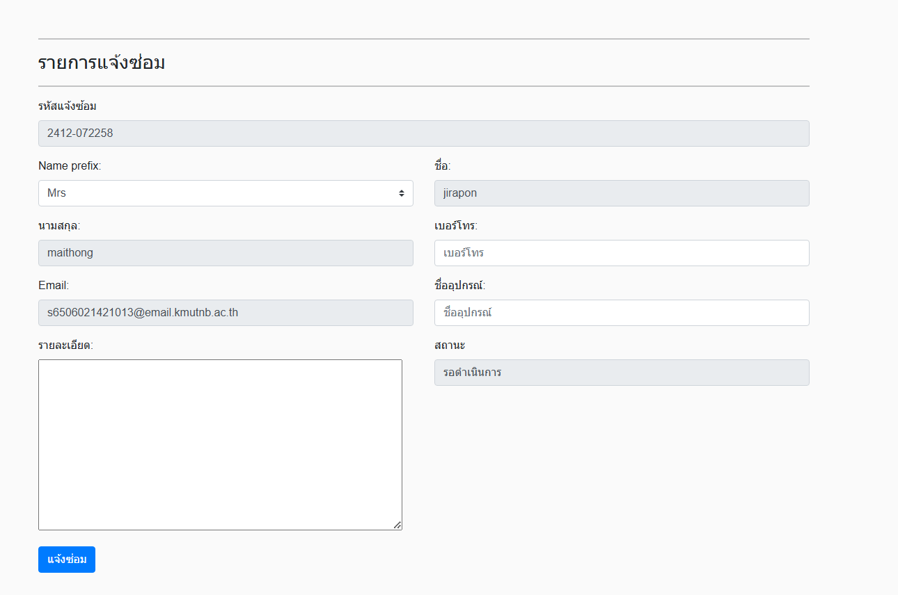
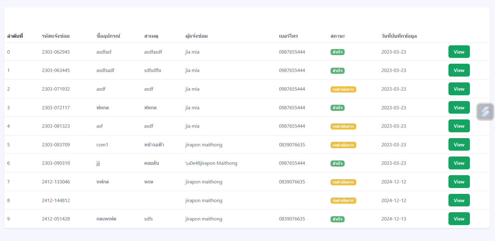
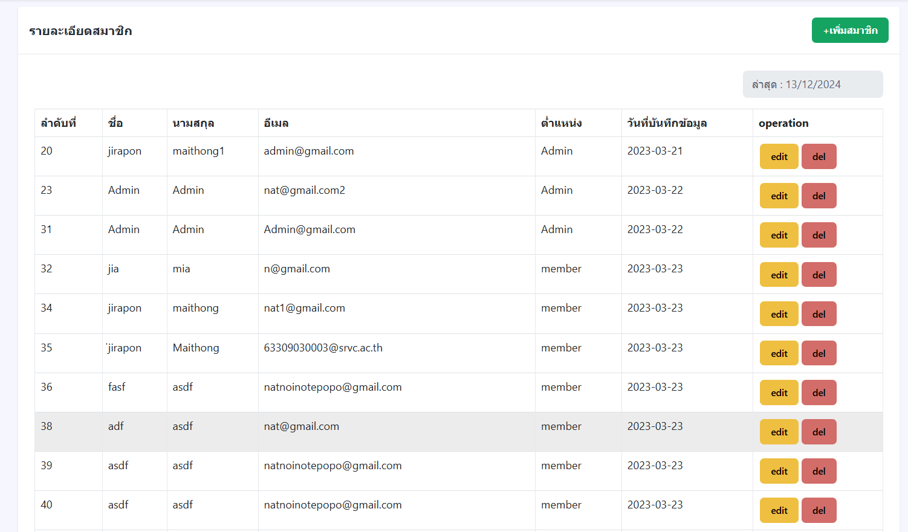

# ระบบการแจ้งซ่อม

## คำอธิบาย
ระบบการแจ้งซ่อมออนไลน์เป็นแพลตฟอร์มที่ช่วยให้ผู้ใช้งานสามารถแจ้งปัญหาเกี่ยวกับอุปกรณ์และติดตามสถานะการซ่อมได้อย่างสะดวก โดยระบบแบ่งบทบาทการใช้งานออกเป็นสองประเภทหลัก คือ **Member** และ **Admin**

---

## คุณสมบัติ
### สำหรับ Member
- สมัครสมาชิกก่อนเข้าใช้งานระบบ
- แจ้งซ่อมอุปกรณ์ผ่านหน้าเว็บไซต์
- ติดตามสถานะการแจ้งซ่อม เช่น รอดำเนินการ สำเร็จ หรือยกเลิก

### สำหรับ Admin
- ตรวจสอบคำร้องขอการแจ้งซ่อมจากสมาชิก
- จัดการข้อมูลสมาชิก เช่น เพิ่ม แก้ไข หรือลบ
- เปลี่ยนสถานะคำร้องขอซ่อม

---

## การใช้งาน
### สำหรับ Member
1. สมัครสมาชิกผ่านหน้าเว็บ (ภาพตัวอย่างด้านล่าง)

   

2. ล็อกอินเข้าสู่ระบบ (ภาพตัวอย่างด้านล่าง)

   

3. กรอกข้อมูลแจ้งซ่อมอุปกรณ์ (ภาพตัวอย่างด้านล่าง)

   

4. ตรวจสอบสถานะคำร้องผ่านแดชบอร์ด

### สำหรับ Admin
1. ตรวจสอบรายการแจ้งซ่อม (ภาพตัวอย่างด้านล่าง)

   

2. จัดการสมาชิก เช่น เพิ่ม แก้ไข หรือ ลบข้อมูล (ภาพตัวอย่างด้านล่าง)

   

---

